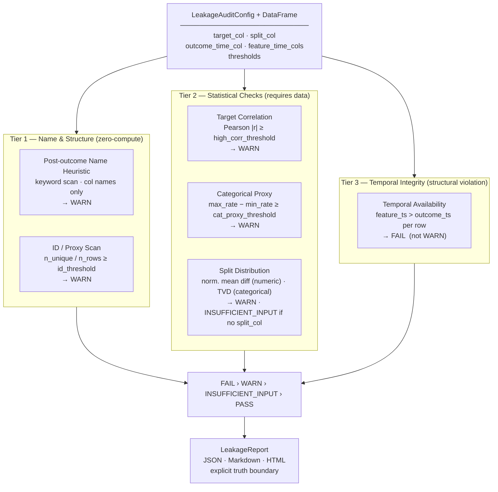

# FeatureLeakageLens

**Pre-training feature leakage auditor for tabular ML datasets.**

<p>
  
  
  
  
</p>

<p>
  
  
  
</p>

FeatureLeakageLens audits tabular ML datasets for suspicious feature leakage patterns **before model training**. It accepts a DataFrame, runs six checks, and returns a structured PASS / WARN / FAIL report the data scientist reviews before fitting a single model.

## About

The worst feature leakage is invisible. A model trained on a post-outcome column doesn't look miscalibrated — it looks exceptional. AUC near 1.0, precision through the roof, validation loss flatlining early. Nothing in the training curves signals the problem. The failure only surfaces when the model hits production and the feature isn't available yet, because it was generated after the event you were trying to predict.

By then, the model has shipped, the business has made decisions on it, and months of development are sunk.

Feature leakage is caught late not because teams are careless, but because the dataset review step is informal. There's no standard checklist, no structured output to attach to a model card, and no CI gate to fail. A data scientist checks the columns they think of checking, in the order they happen to think of them, before moving on to the work that feels more like real ML.

FeatureLeakageLens makes that review step explicit, systematic, and documentable. It checks column names for post-outcome terms, scans for suspiciously correlated features, looks for categorical target-rate proxies, verifies timestamps, flags high-cardinality IDs, and tests for train/test distribution shift — before any model is trained. The output is a per-feature audit report in JSON, Markdown, and HTML, with a clear status and evidence you can attach to a pull request or model card review.

The truth boundary is stated on every report: this tool flags suspicious patterns. The domain expert confirms whether a feature was actually available at prediction time.

## Architecture



## The 6 checks

| Tier | Check | Method | Status |
|---|---|---|---|
| Name & Structure | Post-outcome name heuristic | Keyword scan on column names | WARN |
| Name & Structure | ID / proxy scan | n_unique / n_rows ≥ threshold | WARN |
| Statistical | Target correlation scan | Pearson \|r\| ≥ threshold | WARN |
| Statistical | Categorical proxy scan | Target-rate gap across values | WARN |
| Statistical | Split distribution scan | Normalised mean diff + TVD | WARN or INSUFFICIENT_INPUT |
| Temporal | Temporal availability | feature_ts > outcome_ts per row | **FAIL** |

Only temporal availability can produce FAIL — it is the one check with no ambiguity. Every other finding requires domain confirmation.

## Truth boundary

FeatureLeakageLens does **not** prove leakage. It flags suspicious patterns for review. Human judgment is required to confirm whether a feature was actually available at prediction time. It is not a replacement for feature-store governance, data contracts, or production monitoring.

## Install

```bash
pip install featureleakagelens
```

## Quickstart

```python
import pandas as pd
from featureleakagelens import LeakageAuditConfig, audit_dataframe

df = pd.read_csv("data/demo_leakage_dataset.csv",
                 parse_dates=["application_ts", "outcome_ts", "payment_received_ts"])

config = LeakageAuditConfig(
    target_col="defaulted",
    split_col="split",
    outcome_time_col="outcome_ts",
    feature_time_cols={"payment_received_flag": "payment_received_ts"},
)

report = audit_dataframe(df, config)

print(report.status)       # FAIL / WARN / PASS
report.save("outputs/")    # writes JSON, Markdown, HTML
```

## Run the demo

```bash
git clone https://github.com/SidharthKriplani/featureleakagelens
cd featureleakagelens
pip install -e .
python scripts/generate_demo_reports.py
open outputs/featureleakagelens_report.html
```

## Resume-safe claim

Built **FeatureLeakageLens**, a pre-training feature leakage auditor for tabular ML datasets that checks for post-outcome name heuristics, target correlation, categorical target-rate proxies, future timestamp leakage, ID/proxy columns, and train/test distribution shift, producing structured JSON/Markdown/HTML audit reports with per-finding PASS/WARN/FAIL/INSUFFICIENT_INPUT status and explicit truth boundary.

## Roadmap

- Mutual information scan for nonlinear proxy detection
- Group leakage check for cross-validation folds (same entity in train and test)
- Time-series walk-forward split validator

## License

MIT
