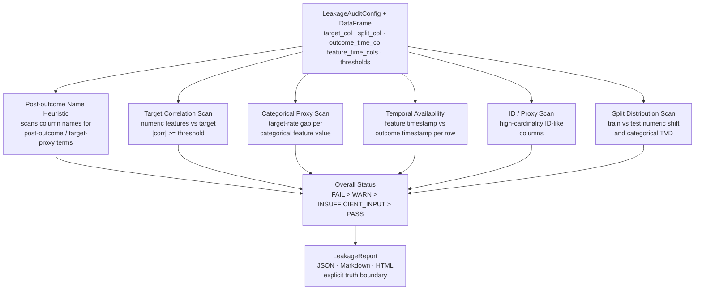

# FeatureLeakageLens

**Pre-training feature leakage auditor for tabular ML datasets.**

<p>
  
  
  
  
</p>

<p>
  
  
  
</p>

FeatureLeakageLens audits tabular ML datasets for suspicious feature leakage patterns **before model training**. It is intentionally an auditor, not a proof engine — it returns structured `PASS / WARN / FAIL / INSUFFICIENT_INPUT` findings and asks the data scientist to review suspicious features rather than claiming it can automatically prove leakage.

## About

Feature leakage is one of the most common failure modes in ML model development. Models that look excellent offline often fail in production because their training data includes information that would not have been available at prediction time: post-outcome columns included by accident, target proxies created during feature engineering, timestamps from after the outcome event, or high-cardinality identifiers that memorize training labels.

These problems are well-known but rarely caught systematically. They are typically discovered late — during production monitoring, in code review, or after a failed deployment.

FeatureLeakageLens makes the leakage review step systematic and reportable. It runs a structured set of checks against the training DataFrame, produces a per-feature audit report, and surfaces findings for human review before a model is trained. The truth boundary is explicit in every report: the tool flags suspicious patterns; the data scientist and domain expert confirm whether a feature was actually available at prediction time.

## Architecture



## Why this exists

Many ML models look excellent offline because the training data includes information unavailable at prediction time. Common failure modes:

- **Post-outcome columns** — a `payment_received_flag` set after the loan outcome is decided
- **Target proxies** — a `default_probability_v1` column computed from the same outcome
- **Future timestamps** — a feature generated after the label date
- **ID leakage** — high-cardinality identifiers that memorize training labels
- **Train/test contamination** — systematic distribution differences suggesting a leaky split

FeatureLeakageLens makes that review systematic and reportable before a model is trained.

## Truth boundary

FeatureLeakageLens does **not** prove leakage. It flags suspicious features for review. Human judgment is required to decide whether a feature was available at prediction time and whether it is valid for the business workflow. It is not a replacement for model review, feature-store governance, data contracts, or production monitoring.

## Install

```bash
pip install featureleakagelens
```

## Quickstart

```python
import pandas as pd
from featureleakagelens import LeakageAuditConfig, audit_dataframe

df = pd.read_csv("data/demo_leakage_dataset.csv",
                 parse_dates=["application_ts", "outcome_ts", "payment_received_ts"])

config = LeakageAuditConfig(
    target_col="defaulted",
    split_col="split",
    outcome_time_col="outcome_ts",
    feature_time_cols={"payment_received_flag": "payment_received_ts"},
)

report = audit_dataframe(df, config)

print(report.status)           # FAIL / WARN / PASS
report.save("outputs/")        # writes JSON, Markdown, HTML
```

## Run the demo

```bash
git clone https://github.com/SidharthKriplani/featureleakagelens
cd featureleakagelens
pip install -e .
python scripts/generate_demo_reports.py
open outputs/featureleakagelens_report.html
```

## Run tests

```bash
python -m unittest discover -s tests -v
```

## The 6 checks

| Check | What it detects |
|---|---|
| Post-outcome name heuristic | Column names containing post-outcome / target-proxy terms |
| Target correlation scan | Numeric features with very high absolute correlation to target |
| Categorical proxy scan | Categorical features with large target-rate gap across values |
| Temporal availability | Feature timestamp after outcome timestamp (future leakage) |
| ID / proxy scan | High-cardinality identifier columns |
| Split distribution scan | Material train/test distribution shift suggesting a leaky split |

## Resume-safe claim

Built **FeatureLeakageLens**, a pre-training feature leakage auditor for tabular ML datasets that checks for post-outcome name heuristics, target correlation, categorical target-rate proxies, future timestamp leakage, ID/proxy columns, and train/test distribution shift, producing structured JSON/Markdown/HTML audit reports with per-finding PASS/WARN/FAIL/INSUFFICIENT_INPUT status and explicit truth boundary.

## License

MIT
